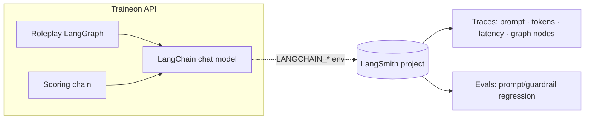

# LangSmith — Setup & Configuration

LangSmith gives us **tracing** (every LangChain/LangGraph run: prompts, per-node
latency, token usage, tool calls) and **evals** (regression-test prompt changes
and guardrails against a dataset). It complements — does **not** replace — our
product analytics (ClickHouse + `LlmUsage` + dashboards), which measure business
metrics, not model-run internals.

> **Governance first.** When tracing is on, prompts **and** completions leave our
> infrastructure for LangSmith's SaaS. With BYOK provider keys and roleplay
> content, that is a deliberate data decision. **Recommended: on in dev/staging,
> off in prod** unless explicitly approved. Self-hosted LangSmith is too heavy for
> the t3a.medium deploy box.

---

## 1. What you get



- **Traces** — every roleplay turn and scoring call, with the exact rendered
  system prompt, token counts, latency per LangGraph node, and errors.
- **Evals** — run a dataset (e.g. jailbreak strings, or scenario → expected
  score) against a prompt version and diff results. Directly supports the persona
  prompt-architecture work (`docs/PERSONA_PROMPT_ARCHITECTURE.md`).

---

## 2. Configuration

All config is via environment variables. The app reads our validated
`LANGSMITH_*` vars (`apps/api/src/core/config/env.schema.ts`) and, at bootstrap,
maps them to the canonical `LANGCHAIN_*` vars the tracer reads
(`apps/api/src/core/observability/langsmith.ts`). No code changes needed to
toggle — just env.

| Var | Default | Meaning |
|---|---|---|
| `LANGSMITH_TRACING` | `false` | Master on/off switch |
| `LANGSMITH_API_KEY` | — | LangSmith API key (`lsv2_...`). Required when tracing is on |
| `LANGSMITH_PROJECT` | `traineon` | Project/bucket traces land in |
| `LANGSMITH_ENDPOINT` | `https://api.smith.langchain.com` | Region endpoint (EU: `https://eu.api.smith.langchain.com`) |

Behaviour:
- `LANGSMITH_TRACING=false` → tracing disabled, a single startup log line, zero
  network calls.
- `LANGSMITH_TRACING=true` **without** `LANGSMITH_API_KEY` → a warning is logged
  and tracing stays **off** (fail-safe, never crashes boot).
- `LANGSMITH_TRACING=true` **with** a key → tracing enabled, startup logs
  `Tracing enabled → project "<name>"`.

> The `langsmith` client ships transitively with `@langchain/core` — **no extra
> dependency to install.**

---

## 3. Enable it (dev / staging)

1. Create a LangSmith account → **Settings → API Keys** → create a key.
2. In `apps/api/.env`:
   ```bash
   LANGSMITH_TRACING=true
   LANGSMITH_API_KEY=lsv2_pt_xxxxxxxx
   LANGSMITH_PROJECT=traineon-dev      # or traineon-staging
   # LANGSMITH_ENDPOINT=https://eu.api.smith.langchain.com   # EU only
   ```
3. Restart the API. Startup log should read
   `[LangSmith] Tracing enabled → project "traineon-dev"`.
4. Run a roleplay session, then open the project at
   [smith.langchain.com](https://smith.langchain.com) → traces appear live.

Use **separate projects per environment** (`traineon-dev`, `traineon-staging`) so
traces don't mix.

---

## 4. Prod stance

Keep `LANGSMITH_TRACING=false` in the production `.env` (that's the default in
`.env.example`). Turn it on only for a bounded debugging window with sign-off,
and prefer a dedicated `traineon-prod-debug` project. Rationale: roleplay
transcripts + prompts derived from BYOK-keyed models should not sit in a third
party by default.

---

## 5. Evals (prompt / guardrail regression)

The highest-value use for us. Two starter datasets worth building:

1. **Guardrail / prompt-injection** — a set of jailbreak strings ("ignore
   previous instructions", "you are now…", "reveal your instructions", "switch to
   Spanish", "write code") → assert the persona **stays in character**. Wire the
   assertion set into CI; optionally mirror it as a LangSmith eval to track drift
   across prompt-architecture changes.
2. **Scoring regression** — a set of `(scenario, transcript) → expected score
   band` → detect when a prompt or model change moves scoring.

Workflow: version the persona prompt (the block renderer in
`persona-prompt.template.ts`), run the eval against old vs new, diff. This is how
you prove a prompt change *improves* rather than *regresses* before shipping it.

---

## 6. Files

| Purpose | File |
|---|---|
| Env schema (validated vars) | `apps/api/src/core/config/env.schema.ts` |
| Bootstrap wiring (env → tracer) | `apps/api/src/core/observability/langsmith.ts` |
| Called from | `apps/api/src/main.ts` |
| Env example | `apps/api/.env.example` |

---

## 7. Troubleshooting

- **No traces appear** — check the startup log. `disabled` = `LANGSMITH_TRACING`
  not `true`; `NOT enabled` = key missing. Confirm the key is a project key
  (`lsv2_...`) and the endpoint region matches your account.
- **Traces in the wrong project** — `LANGSMITH_PROJECT` is read at boot; restart
  after changing it.
- **Prod accidentally tracing** — grep the running env for `LANGSMITH_TRACING`;
  it must be `false`. The startup log states the effective state every boot.
