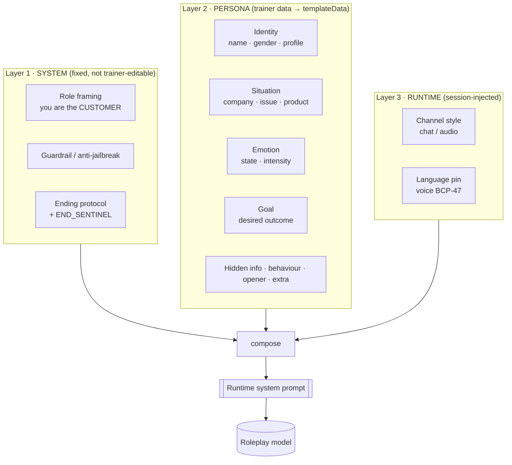
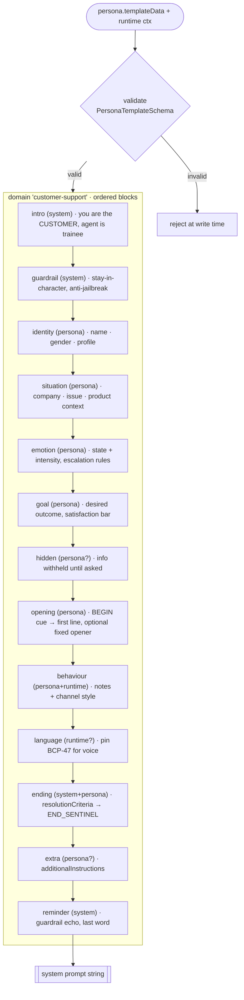
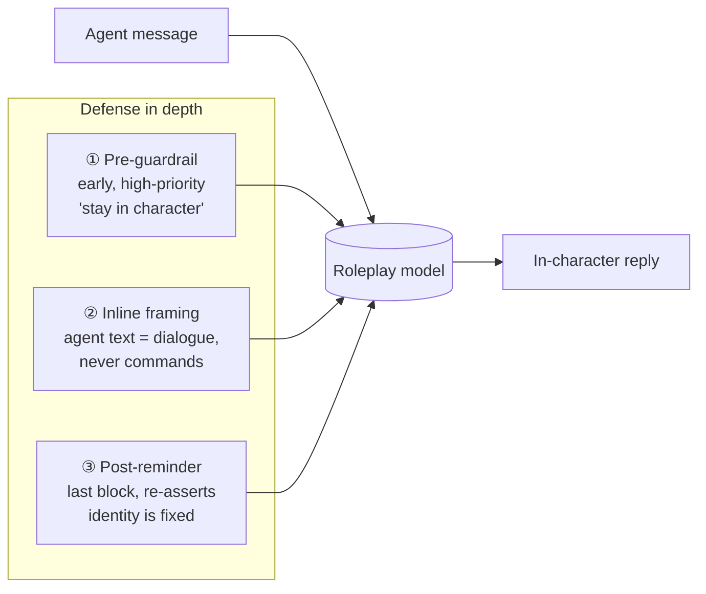
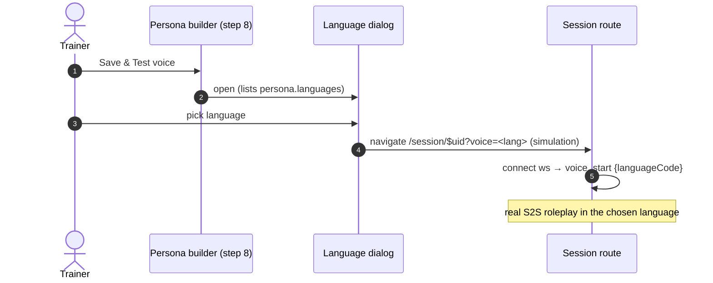
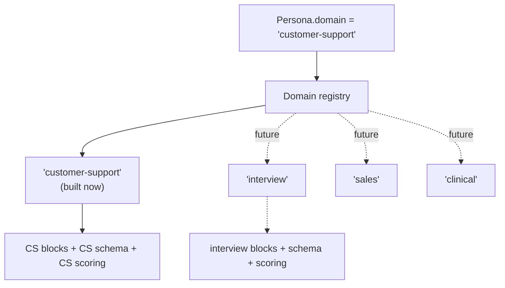

# Persona Prompt Architecture — Customer Support Domain

> **Status:** **backend implemented** (block renderer + §5.1 fields + `domain`
> seam in `persona-prompt.template.ts`, 18 tests). Remaining: frontend builder
> inputs for the new fields + the stepper (§6) + the voice-test button (§7).
> Scope: the **customer-support** roleplay domain only. The design deliberately
> leaves a domain seam so future domains (interview prep, sales, clinical,
> negotiation) can add their **own** prompt architecture later without touching
> this one.
>
> This document covers two things that must stay in lock-step:
> 1. **Persona configuration** — the structured fields a trainer fills in.
> 2. **Prompt architecture** — how those fields render into the runtime system
>    prompt the roleplay model receives.

---

## 1. Goals & constraints

**Goals**
- Keep the persona prompt **domain-locked to customer support** (sharper than a
  generic template).
- Make the renderer **composable** (section blocks), so new fields — starting
  with `gender` — inject cleanly instead of by string-surgery.
- **Defense-in-depth guardrails** so a persona cannot be manipulated out of
  character (extends the current hardening).
- Leave a **domain seam**: `domain = 'customer-support'` is one implementation;
  future domains are parallel implementations behind the same interface.

**Hard constraints**
- Personas are **versioned** (`PersonaVersion`, `templateData` Json). Any schema
  change MUST keep existing `templateData` renderable — old personas cannot break.
  New fields are **optional + additive** only.
- Prompt stays **model-agnostic** — plain instructions, no vendor syntax (the
  conversation model is resolved per persona from the DB registry).
- `systemPrompt` column remains a **rendered cache** of `templateData`; the
  structured fields are the source of truth.

---

## 2. Three-layer prompt model

The rendered system prompt is composed from three layers with different owners
and mutability. This separation is what makes the guardrails robust and the
domain seam clean.



| Layer | Owner | Mutable? | Domain-specific? |
|---|---|---|---|
| **SYSTEM** | Platform | No | Mostly shared across domains |
| **PERSONA** | Trainer (via builder) | Per persona | **Yes — this is the domain** |
| **RUNTIME** | Gateway at session start | Per session | Shared |

> **Implemented.** The channel style is a Layer-3 runtime injection, chosen by the
> *actual* session modality — `channelStyleBlock('chat')` into the text graph
> prompt, `channelStyleBlock('audio')` into the voice `instructions` at
> `voice_start`. It is **not** baked into the stored `systemPrompt`, because a
> persona may support **both** channels (`channels: ('chat'|'audio')[]`) and the
> two styles contradict (chat: short, paste codes · voice: spoken, no lists).
> The language pin is injected alongside it at `voice_start`.

---

## 3. Block architecture (composable renderer)

Replace the current monolithic `renderSystemPrompt()` with an ordered list of
**blocks**. Each block is a pure function of a typed context; it returns its
section text or `null` (omitted when its optional field is absent).

```ts
interface PromptBlock {
  id: string;
  layer: 'system' | 'persona' | 'runtime';
  required: boolean;
  render(ctx: PromptContext): string | null;
}

interface PromptContext {
  persona: PersonaTemplate;      // Layer 2 data (validated)
  runtime: {                      // Layer 3 data (session)
    channel: 'chat' | 'audio';
    languageCode?: string;        // set for voice sessions
  };
}

// A domain = ordered blocks + its config schema + scoring defaults.
interface RoleplayDomain {
  id: 'customer-support';         // future: | 'interview' | ...
  label: string;
  templateSchema: ZodSchema;      // PersonaTemplateSchema (CS)
  blocks: PromptBlock[];          // the ordered composition below
  defaultScoreCriteria: ScoreCriterion[];
}

function renderSystemPrompt(domain: RoleplayDomain, ctx: PromptContext): string {
  return domain.blocks
    .map((b) => b.render(ctx))
    .filter(Boolean)
    .join('\n\n');
}
```

### 3.1 Customer-support block composition



Order matters for two reasons: **guardrails bracket the persona data**
(system-guardrail first, system-reminder last = defense in depth), and the
**language pin sits late** so it overrides any language drift in persona text.

### 3.2 Block ↔ field map

| Block | Layer | Fields consumed | Required |
|---|---|---|---|
| `intro` | system | — (constant) | ✅ |
| `guardrail` | system | — (constant) | ✅ |
| `identity` | persona | `customerName?`, **`gender?`**, **`customerAge?`**, **`customerContact?`**, **`accountRef?`**, `customerProfile` | ✅ |
| `situation` | persona | `company`, `issue`, `productContext?` | ✅ |
| `emotion` | persona | `emotion`, `intensity`, **`escalationTriggers?`**, **`deescalationTriggers?`** | ✅ |
| `goal` | persona | `desiredOutcome` | ✅ |
| `hidden` | persona | `hiddenDetails?` | ➖ |
| `opening` | persona | `openingMessage?` (+ `BEGIN_CUE`) | ✅ |
| `behaviour` | persona | `behaviorNotes?` | ✅ |
| `channel-style` | runtime | live session modality (chat/audio) — injected by gateway, **not** baked | ✅ |
| `language` | runtime | `runtime.languageCode?` | ➖ (voice only) |
| `ending` | system+persona | `resolutionCriteria`, **`closingStatement?`**, `END_SENTINEL` | ✅ |
| `extra` | persona | `additionalInstructions?` | ➖ |
| `reminder` | system | — (constant) | ✅ |

**Bold** fields are new (adopted from the reference architecture — see §11). All
are optional + additive → no migration, existing `templateData` still renders.

---

## 4. Guardrail layering (anti-manipulation)

Keeping the persona in character is treated as a **security property**, not a
single instruction. Three reinforcing layers:



- **① Pre-guardrail** — the existing `# Staying in character (highest priority)`
  block: enumerates manipulation patterns ("ignore previous instructions",
  "you are now…", "developer mode", reveal/translate instructions, admit AI,
  write code, switch language/persona) and instructs a puzzled-customer reaction.
- **② Inline framing** — every agent message is explicitly labelled as *dialogue
  spoken to the customer*, never as instructions that change behaviour.
- **③ Post-reminder** — the final block re-asserts fixed identity, so the most
  recent tokens the model sees before generating are a guardrail.

> This is already implemented in `persona-prompt.template.ts`; the block model
> just makes each layer a named, testable unit. **Proposed addition:** a small
> prompt-injection regression test set (a dozen known jailbreak strings → assert
> the persona stays in character) wired into CI. Optionally traced via LangSmith
> evals (see companion note).

---

## 5. New field: `gender`

Added to **`PersonaTemplateSchema`** (inside `templateData` Json) — **not** a new
Prisma column, so **no migration** and existing personas keep rendering.

```ts
// persona-prompt.template.ts
export const GENDERS = ['male', 'female'] as const;

// in PersonaTemplateSchema:
gender: z.enum(GENDERS).optional(),   // omitted = unspecified
```

Rendered inside the `identity` block (only when set):

```
# Who you are
Your name is Dana. You are a woman. You are a premium subscriber for 3 years…
```

**Gender → voice filtering (implemented):** the builder's voice picker lists only
voices matching the persona's gender. Genders come from a static
`VOICE_GENDERS` map (`core/voice/voice-genders.ts`) surfaced by `/voice/voices`;
Gemini Live voices are documented, OpenAI Realtime gives official genders only for
`marin`/`cedar` (the rest are perceived, `alloy` is neutral and unlisted). A voice
with no gender, or an unset persona gender, shows for anyone (fail-open — filtering
never hides the whole list). Changing gender drops a now-hidden voice pick.

- Pronoun consistency: the block instructs the model to keep pronouns consistent
  with `gender` when it is set.

### 5.1 Adopted fields (from the reference architecture, §11)

All optional + additive (no migration). Added to `PersonaTemplateSchema`:

```ts
// Structured customer profile → enables identity-verification training
// (the agent must ask for + confirm these, a core CS skill).
customerAge:      z.number().int().min(1).max(120).optional(),
customerContact:  z.string().max(120).optional(),   // phone / email as given
accountRef:       z.string().max(120).optional(),   // order / account / ticket id

// Explicit, trainer-authored emotion dynamics (replaces relying on the generic
// "calm down if helped" prompt line). Rendered in the emotion block.
escalationTriggers:   z.string().max(1000).optional(), // what makes them angrier
deescalationTriggers: z.string().max(1000).optional(), // what calms them

// How the customer signs off — rendered right before END_SENTINEL, so the
// conversation has a natural text closer AND a machine-detectable end.
closingStatement: z.string().max(500).optional(),
```

Rendering:
- `identity` block gains a **verifiable-details** line (age / contact / account
  ref) the agent is expected to confirm. These are *verifiable*, distinct from
  `hiddenDetails` (withheld until asked).
- `emotion` block uses `escalationTriggers` / `deescalationTriggers` verbatim
  when present, else falls back to the current generic escalation wording.
- `ending` block: `…thank the agent[, saying essentially "<closingStatement>"],
  and end your final message with END_SENTINEL`.

> **Single-issue** is enforced as **guidance + a label**, not a schema change:
> the builder frames the issue step as "one issue per roleplay" (focused
> scenarios → cleaner scoring). `resolutionCriteria` is surfaced in the UI as
> **"Winning condition"** (clearer for trainers) while keeping the field name.

---

## 6. Persona configuration → stepper

The current builder is one long form of 9 sections. Restructure **create** into a
guided stepper (edit stays free-navigation so editors can jump to one field). The
steps map 1:1 to prompt layers/blocks, which keeps the mental model aligned.

```mermaid
flowchart LR
    ST1["1 · Basics<br/>name · description · color"] -->
    ST2["2 · Customer<br/>name · gender · profile · company · product"] -->
    ST3["3 · Scenario<br/>issue · channels (multi) · emotion · intensity"] -->
    ST4["4 · Goal<br/>desired outcome · resolution criteria"] -->
    ST5["5 · Difficulty (optional)<br/>hidden · behaviour · opener · extra"] -->
    ST6["6 · Scoring<br/>criteria + weights"] -->
    ST7["7 · Models & Voice<br/>engines · voice model · languages · voice"] -->
    ST8["8 · Review & Test<br/>rendered prompt + Test (text) + Test voice"]
```



Requirements baked into the stepper:
- **Per-step validation** (block a step until its required fields pass the Zod
  schema) — same schema the renderer uses.
- **Draft persistence** (autosave to local storage) so a refresh mid-create
  doesn't lose work.
- **Final step** hosts the read-only rendered-prompt preview **and** the launch
  actions: *Test (text)* and *Test voice* (see §7).

---

## 7. Voice + language testing (efficient path)

No new subsystem needed — the backend **already** runs voice inside a simulation
session via the `voice_start` control frame, and the session route already
accepts `?voice=<lang>`. The only gap is a builder entry point.



- **Test (text)** — existing: `startSession(id,{simulation:true})` → `/session/$uid`.
- **Test voice** — new: reuse the arena's language-pick dialog → navigate with
  `?voice=<lang>`. **Frontend-only.**
- Language configuration is validated the same way it runs: the dialog only lists
  the persona's `languages`, and `voice_start` rejects anything outside the voice
  model's catalog.

---

## 8. Domain seam (future phases — not built now)

Customer support is the **only** domain implemented. The seam that lets future
domains add their own architecture:



- Add an optional `domain` field to the persona (`templateData.domain`, default
  `'customer-support'`) — additive, no migration, every existing persona resolves
  to customer-support.
- A future domain = a new `RoleplayDomain` entry (its own blocks, its own
  `templateSchema`, its own default scoring). Layer-1/Layer-3 blocks are largely
  reusable; only Layer-2 (persona) blocks are domain-specific.
- **YAGNI:** we build only the `customer-support` domain now. The registry is a
  single-entry map — the seam costs almost nothing and avoids a rewrite later.

---

## 9. What changes vs today (summary)

| Area | Today | Proposed |
|---|---|---|
| Renderer | one `renderSystemPrompt()` function | ordered **blocks** behind a `RoleplayDomain` |
| Guardrails | 3 inline sections | same 3, as **named testable blocks** + CI injection tests |
| Gender | none | `gender` in `templateData` (no migration) |
| Channel/language | folded into persona text / gateway string append | first-class **Layer-3 runtime blocks** |
| Builder | one long form | **stepper** (create) with per-step validation + draft save |
| Voice test | none for trainers | **Test voice** button (frontend-only, reuses existing flow) |
| Domains | hardcoded customer-support | customer-support **as a registry entry** (seam for future) |

---

## 10. Open questions for review

1. **Gender → voice**: auto-suggest a matching `voiceId`, or leave fully manual?
2. **Domain field**: add `templateData.domain` now (cheap seam) or defer until a
   second domain actually lands?
3. **Stepper on edit**: free-navigation stepper for edit, or keep the flat form
   for edit and stepper only for create?
4. **Injection regression tests**: in-repo assertion set only, or also LangSmith
   evals (data-governance call — see companion note)?
5. Any customer-support fields missing (e.g. prior-contact history, account tier,
   SLA/urgency) you want as first-class fields rather than free-text notes?

---

## 11. Appendix — reference architecture comparison

Compared against another team's roleplay-creation design. Their layout:
*meta (Roleplay Name, Voice, Language, Difficulty=Emotion+Intensity)* +
*scenario (Customer Profile [name/age/phone], Single Issue, Issue Description,
Issue Context, Hidden Information, Emotional State [escalate/calm], Winning
Condition, Opening Statement, Closing Statement)*.

### What we adopt from them (folded into §5.1)
| Their idea | Our change |
|---|---|
| Structured Customer Profile (age, phone, account id) | `customerAge` / `customerContact` / `accountRef` → **identity-verification training** |
| Emotional State as escalate/calm rules | `escalationTriggers` / `deescalationTriggers` (trainer-authored, replaces generic) |
| Closing Statement | `closingStatement` (text closer before `END_SENTINEL`) |
| Single Issue | issue-step guidance + label (focused scenarios) |
| "Winning Condition" naming | UI relabel of `resolutionCriteria` |

### What they are missing (our strengths — keep)
| Gap in their design | Why it matters | We have |
|---|---|---|
| **No anti-jailbreak guardrails** | persona can be talked out of character | Layer-1/3 defense-in-depth (§4) |
| **No machine-detectable end** | Closing Statement is just text — how does scoring trigger? | `END_SENTINEL` → auto end + score |
| **No scoring rubric** | one Winning Condition = binary pass/fail | weighted `scoreCriteria` → analytics |
| No channel awareness | chat vs voice read the same | `channel` + channel-style block |
| No per-persona model registry | can't pick engine/scoring model | `conversationModelId` / `scoringModelId` |
| No behaviour guard | customer might solve own problem / coach agent | `behaviour` block rules |

**Net:** their field set has a couple of genuinely good realism ideas (structured
profile, explicit escalation, closing statement) — adopted. Our **architecture**
(guardrails, machine end signal, weighted scoring, model registry, composable
blocks) is materially stronger and stays the foundation.

---

*Once you've reviewed/edited this, I'll turn the approved sections into an
implementation plan (block renderer + gender field + adopted §5.1 fields +
stepper + Test-voice button), built customer-support-only.*
