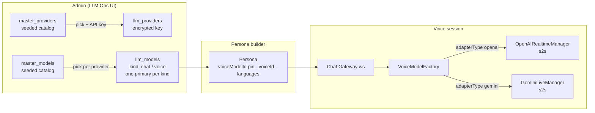
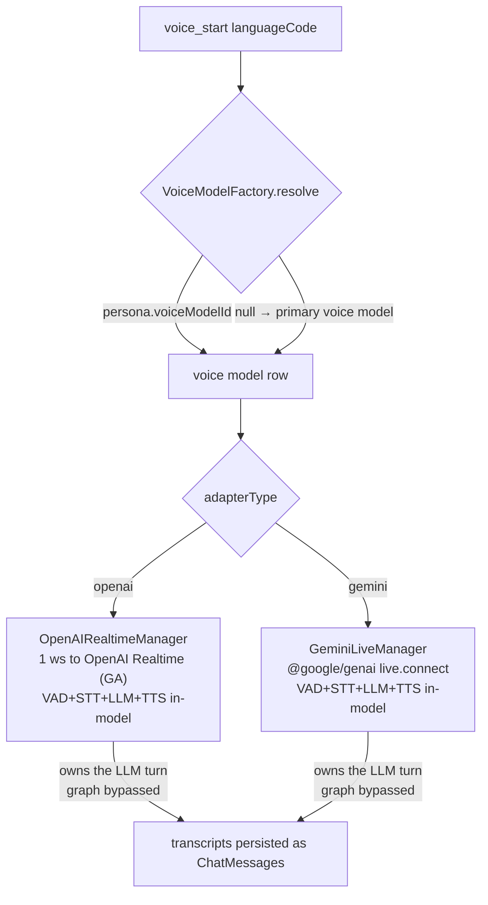
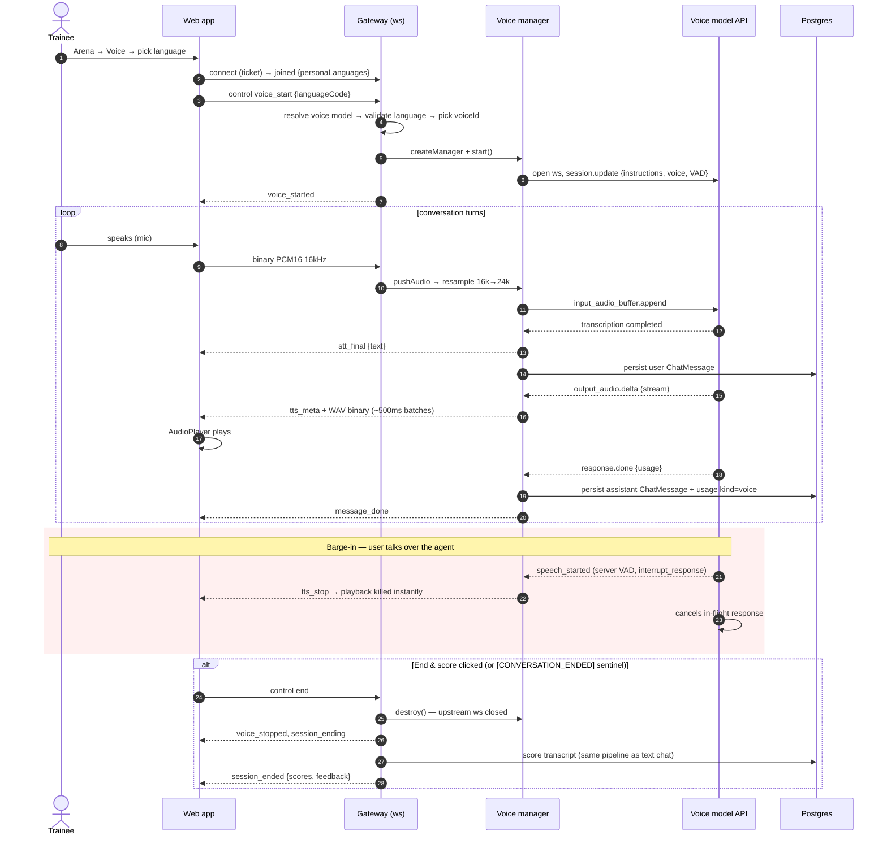
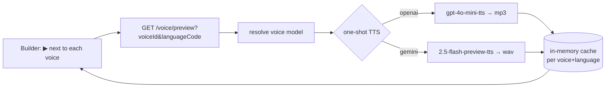

# Voice Chat — End-to-End Session Flow

One document for the whole voice stack: how a voice model gets configured, how a
trainee's spoken session flows through the system, and what other developers run
after pulling this feature.

---

## 1. Big picture



Voice is **native speech-to-speech only** (OpenAI Realtime, Gemini Live) — one
upstream socket does VAD+STT+LLM+TTS in-model.

- **Masters** are seeded (`npm run seed:llm`, ad-hoc via `npm run model:add`) and
  never edited through the API.
- **Configured provider** = master + API key (AES-256-GCM at rest; only a masked
  hint like `sk-…Yn4A` is returned).
- **One primary per kind**: one primary chat model AND one primary voice model —
  they may be on different providers (e.g. gpt-4o-mini chat + Gemini Live voice).
- **Persona** optionally pins a voice model (`voiceModelId`), a spoken voice
  (`voiceId`, previewable in the builder), and the trainee-selectable `languages`.

## 2. Pipeline dispatch



Both managers implement the same `IVoiceManager` contract
(`start / pushAudio / cancel / destroy`) — the gateway never sees provider
specifics. System prompt + a language-pinning instruction go to the S2S model as
`instructions`; the model owns the LLM turn and the app LangGraph is bypassed.

## 3. Session sequence (S2S, e.g. OpenAI Realtime)



## 4. Voice previews (persona builder)



Sample text is localized (11 Indic languages + English). First play makes one
tiny TTS call; repeats are served from cache in milliseconds.

## 5. Client ⇄ gateway frame reference

| Direction | Frame | Meaning |
|---|---|---|
| → | `{control, action: 'voice_start', languageCode, voiceId?}` | begin voice loop |
| → | binary PCM16 16kHz | mic audio (AudioWorklet) |
| → | `{control, action: 'cancel'}` | manual interrupt |
| → | `{control, action: 'voice_stop'}` | leave voice mode |
| → | `{control, action: 'end'}` | End & score |
| ← | `voice_started` / `voice_stopped` | loop state |
| ← | `stt_partial` / `stt_final` | captions / settled user turn |
| ← | `tts_meta` + binary WAV | assistant audio (24kHz pcm16) |
| ← | `tts_stop` | kill playback (barge-in) |
| ← | `message_done`, `session_ending`, `session_ended` | same as text chat |

## 6. Developer setup after pulling this feature

From the repo root:

```bash
# 1. Pull the branch
git pull                              # or: git checkout feature/model-masters

# 2. Install new dependencies (@langchain/anthropic, @google/genai, core pin)
npm install

# 3. Apply migrations (forward-only, NO data loss)
cd apps/api
npx prisma migrate deploy
npx prisma generate

# 4. Seed the master catalog (REQUIRED — idempotent, safe to re-run)
npm run seed:llm

# 5. Restart services
npm run dev                           # apps/api (and apps/web in another shell)
# docker VM instead:
#   docker compose up -d --build api web
```

> `migrate deploy` drift warning about `checkpoint_*` tables = LangGraph
> runtime tables, expected — do NOT reset the database.

Then one-time admin configuration in the UI:

1. **LLM Ops → Providers → Add provider** — pick a master (OpenAI / Google /
   Anthropic), paste the API key.
2. **LLM Ops → Models → Add model** — pick provider → Chat or Voice tab →
   pick from the catalog. First of each kind auto-primaries.
3. **Persona builder → Voice** — optionally pin a voice model, pick a voice
   (▶ previews it), select trainee languages.

Notes:
- Voice = native S2S only (OpenAI Realtime, Gemini Live). Gemini Live covers the
  Indic languages (hi/bn/ta/te/mr/gu/kn/ml); OpenAI Realtime is en/hi.
- Add future catalog models without code changes:
  `npm run model:add -- --provider google --kind voice --key <model-id> --name "..." --pipeline s2s --languages en-IN,hi-IN`

## 7. Key files

| Area | File |
|---|---|
| Manager contract | `apps/api/src/core/voice/voice-manager.ts` |
| Factory (resolve + dispatch) | `apps/api/src/core/voice/voice-model-factory.service.ts` |
| OpenAI Realtime (GA) | `apps/api/src/core/voice/managers/openai-realtime.manager.ts` |
| Gemini Live | `apps/api/src/core/voice/managers/gemini-live.manager.ts` |
| Previews | `apps/api/src/core/voice/voice-preview.service.ts` |
| Gateway wiring | `apps/api/src/modules/realtime/chat.gateway.ts` |
| Registry API | `apps/api/src/modules/llm-ops/` |
| Master seed / ad-hoc add | `apps/api/prisma/seed-llm.ts`, `apps/api/prisma/add-master-model.ts` |
| Client session hook | `apps/web/src/features/roleplay/use-roleplay-session.ts` |
| Voice UI (orb overlay) | `apps/web/src/routes/_auth/session/$uid.tsx` |
