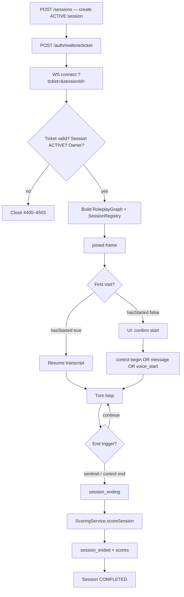
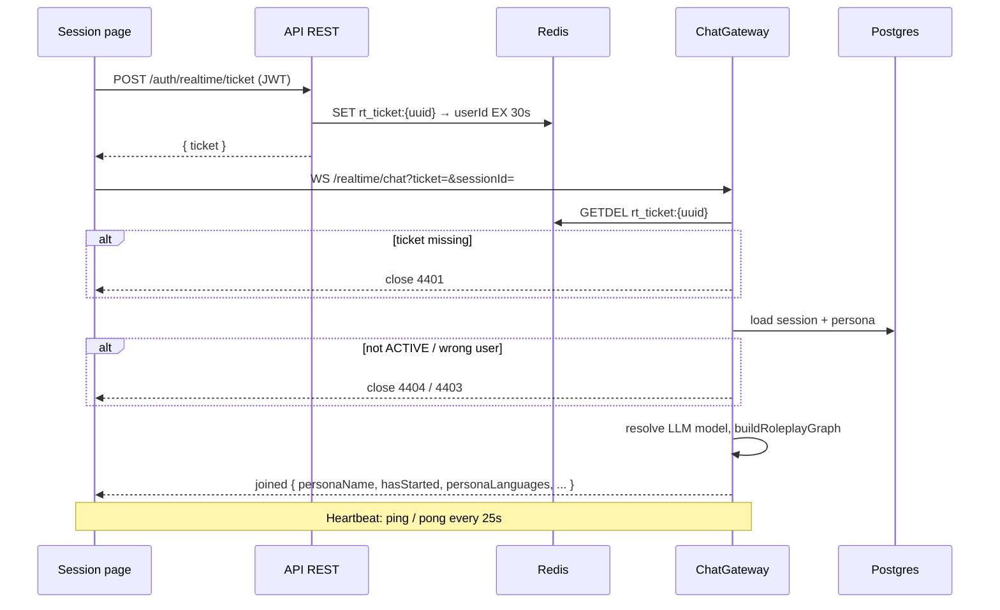
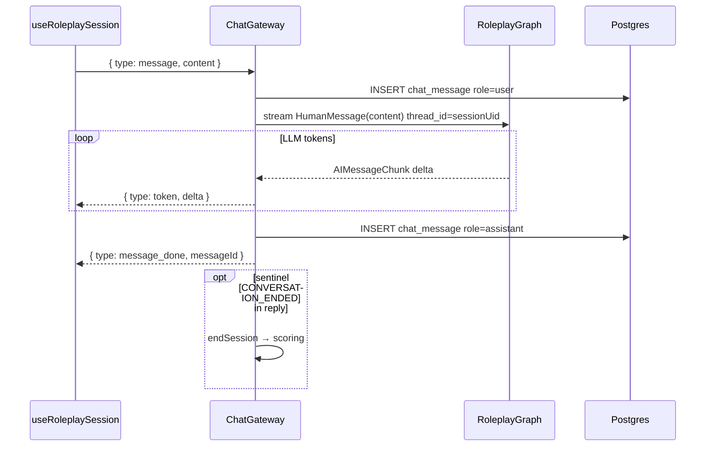
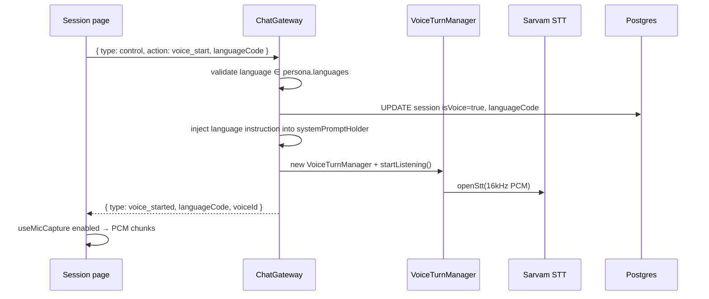
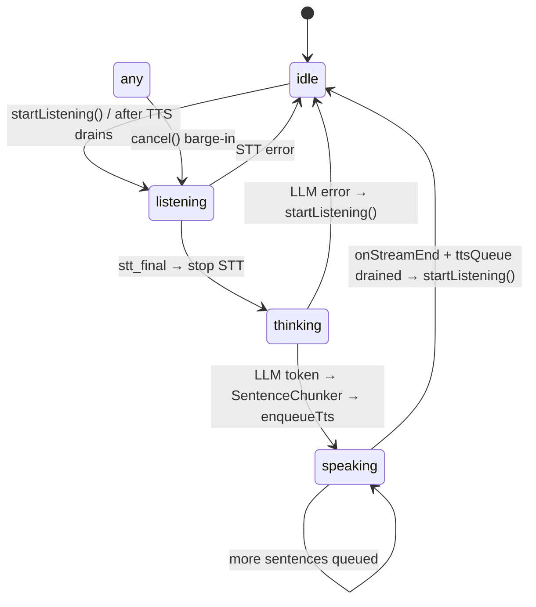
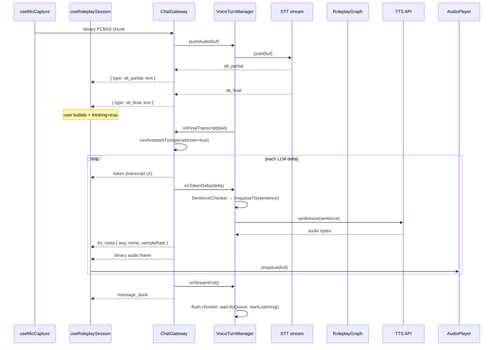
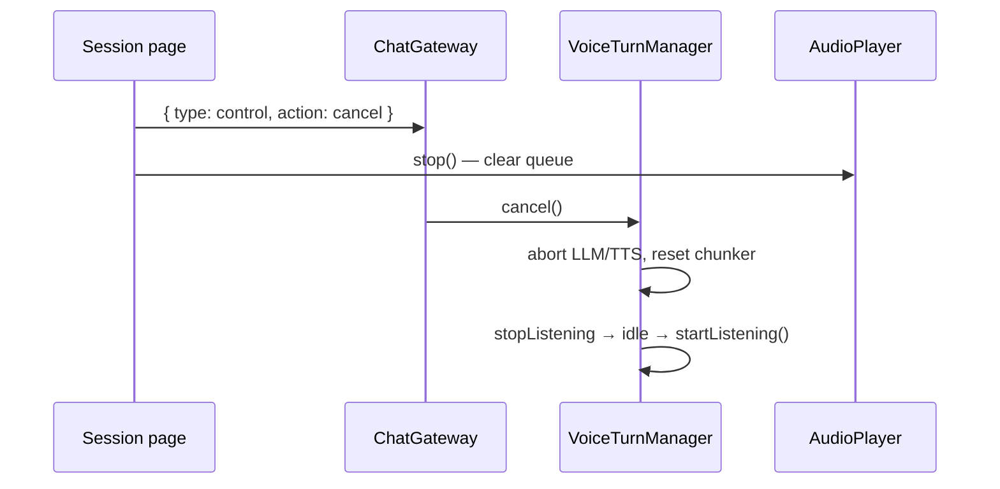
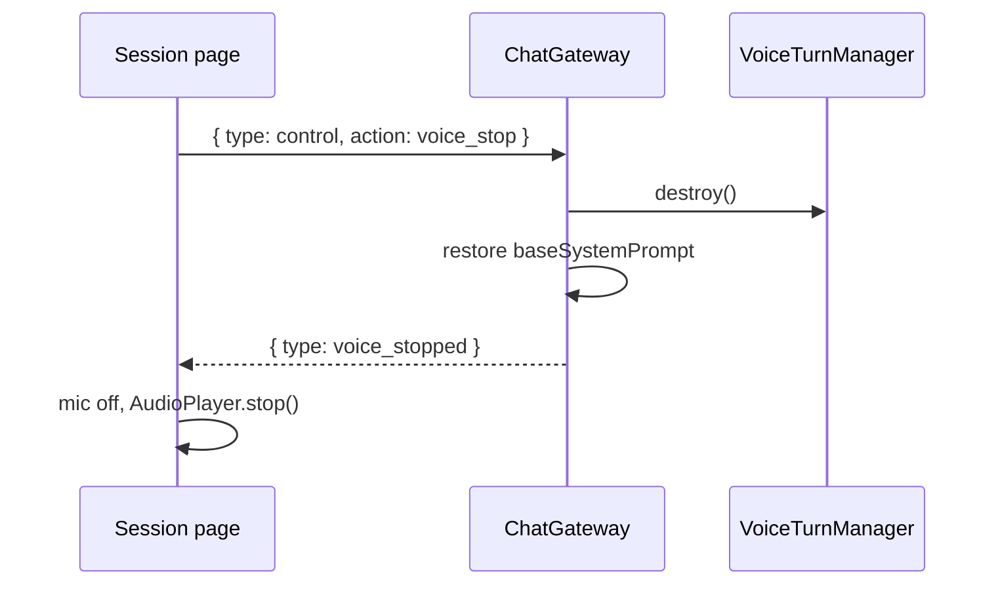
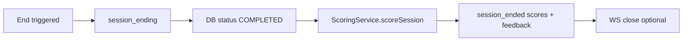
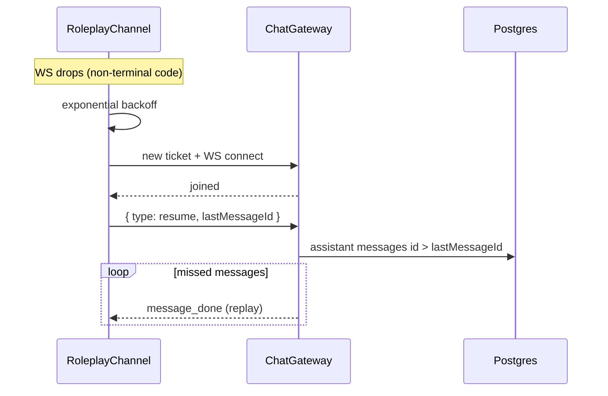

# Voice Session & Conversation Flow

How a roleplay session connects, runs text or voice turns, ends, and scores. This doc is the map for the realtime stack: WebSocket gateway, LangGraph roleplay agent, and Sarvam STT/TTS loop.

Related: [WS_AUTH_TICKET.md](./WS_AUTH_TICKET.md) · [BACKEND_ARCHITECTURE.md](./BACKEND_ARCHITECTURE.md)

---

## Overview

A **session** is a trainee conversation with a persona (the “customer”). The client opens one WebSocket per active session. All turns — typed or spoken — share the same path:

1. **Connect** with a one-time ticket and receive a `joined` handshake.
2. **Turn loop**: user input → LangGraph stream → assistant reply (tokens + optional TTS).
3. **End**: sentinel, explicit end, or idle timeout → scoring → `session_ended`.

**Voice mode** adds a parallel audio pipeline on the same socket: mic PCM → STT → same LLM turn → sentence-chunked TTS → speaker playback. Text chat frames (`token`, `message_done`) still flow so the transcript UI stays in sync.

| Mode | User input | Assistant output |
|------|------------|------------------|
| Text | `{ type: "message", content }` | `token` + `message_done` |
| Voice | Binary PCM16 @ 16 kHz | `stt_*` + `token` + `tts_meta` + binary audio + `message_done` |

---

## System map

```
┌─────────────────────────────────────────────────────────────────────────┐
│  Browser (apps/web)                                                      │
│  ┌──────────────────┐  ┌─────────────────┐  ┌──────────────────────┐  │
│  │ useRoleplaySession│  │ RoleplayChannel │  │ useMicCapture        │  │
│  │ (React hook)      │──│ (ws-client)     │  │ + pcm-processor.js   │  │
│  └────────┬─────────┘  └────────┬────────┘  └──────────┬───────────┘  │
│           │                     │                       │ PCM chunks    │
│           │                     │ JSON + binary         │               │
└───────────┼─────────────────────┼───────────────────────┼───────────────┘
            │                     │                       │
            ▼                     ▼                       ▼
┌─────────────────────────────────────────────────────────────────────────┐
│  API (apps/api) — ChatGateway @ /api/v1/realtime/chat                    │
│  ┌─────────────────┐  ┌──────────────────┐  ┌─────────────────────┐   │
│  │ SessionRegistry │  │ runAssistantTurn │  │ VoiceTurnManager    │   │
│  │ (per WS client) │──│ (LangGraph stream)│◄─│ idle→listen→think→  │   │
│  └─────────────────┘  └────────┬─────────┘  │      speak          │   │
│                                 │             └──────────┬──────────┘   │
│                                 │                        │              │
│                    Postgres (messages, checkpoint)       │              │
│                                 │             ┌──────────▼──────────┐   │
│                                 │             │ VoiceProvider       │   │
│                                 │             │ (Sarvam STT/TTS)    │   │
│                                 └─────────────┴─────────────────────┘   │
└─────────────────────────────────────────────────────────────────────────┘
```

---

## 1. Session lifecycle (end-to-end)



**Key behaviors**

- **`joined` is the ready signal.** The gateway attaches the message listener only after async setup. Do not send frames before `joined`.
- **`hasStarted`** (message count > 0) prevents the start dialog from reappearing on reconnect.
- **`begin`** sends an internal `BEGIN_CUE` to the persona (not stored as a user message). Idempotent once any message exists.
- **Disconnect does not end the session.** Client reconnects with a fresh ticket and optional `resume`.

---

## 2. WebSocket connection flow



See [WS_AUTH_TICKET.md](./WS_AUTH_TICKET.md) for ticket rationale and close codes.

---

## 3. Text conversation turn flow



**Streaming details**

- History lives in the **LangGraph checkpointer** (`thread_id = session.uid`). Each turn only appends one new `HumanMessage`.
- A **hold-back buffer** strips `[CONVERSATION_ENDED]` before it reaches the client (the sentinel can split across chunks).
- **`message_done.messageId`** is the DB primary key string — used for reconnect replay.

---

## 4. Voice session flow

Voice uses the **same WebSocket** and the **same `runAssistantTurn`** as text. A `VoiceTurnManager` wraps STT/TTS around that core.

### 4.1 Starting voice



**Language lock:** On `voice_start`, the gateway appends a high-priority “respond only in {lang}” block to the live system prompt. On `voice_stop`, the base prompt is restored.

**Voice ID:** Client may pass `voiceId`; otherwise the persona’s `voiceStyle.voiceId` is used (default `priya`).

### 4.2 Voice turn state machine

Each connection has at most one `VoiceTurnManager` (`wsClient.voiceTurn` in `SessionRegistry`).



| State | What happens |
|-------|----------------|
| **listening** | Mic PCM pushed to STT; `stt_partial` / `stt_final` sent to client |
| **thinking** | Final transcript passed to `runAssistantTurn`; LLM streaming |
| **speaking** | Completed sentences synthesized; `tts_meta` + binary audio sent |

### 4.3 Single voice turn (full sequence)



**Latency strategy:** TTS starts on **sentence boundaries** (`. ? ! ।` or newline), not after the full reply. The `SentenceChunker` uses a minimum length (12 chars) to avoid fragmenting abbreviations.

**Dual output:** Even in voice mode, the client receives **`token` frames** for the assistant bubble and **`tts_meta` + binary** for playback — one logical turn, two render paths.

### 4.4 Barge-in (cancel)

When the user speaks over the assistant:



Server-side `cancel()` aborts the in-flight TTS queue via `AbortController`, clears the sentence chunker, and immediately reopens STT.

### 4.5 Stopping voice



Text turns continue to work after `voice_stop`; only the audio loop is torn down.

---

## 5. Session end & scoring

End triggers (any one):

| Trigger | Source |
|---------|--------|
| `[CONVERSATION_ENDED]` sentinel | Persona LLM reply |
| `{ type: control, action: end }` | UI “End & score” |
| `POST /sessions/:uid/end` | HTTP (scores via BullMQ queue) |



On disconnect mid-voice, `handleDisconnect` calls `voiceTurn.destroy()` before removing the client from `SessionRegistry`.

---

## 6. Reconnect flow



Terminal close codes **4400–4599** (bad ticket, forbidden, no model) stop retrying and surface an error.

---

## 7. WebSocket frame reference

### Client → server

| Frame | Purpose |
|-------|---------|
| `{ type: "message", content, id }` | Text user turn |
| `{ type: "control", action: "begin" }` | Persona opens conversation (first turn only) |
| `{ type: "control", action: "end" }` | End and score |
| `{ type: "control", action: "voice_start", languageCode, voiceId? }` | Start voice loop |
| `{ type: "control", action: "voice_stop" }` | Stop voice loop |
| `{ type: "control", action: "cancel" }` | Barge-in |
| `{ type: "resume", lastMessageId }` | Replay after reconnect |
| `{ type: "ping" }` | Heartbeat |
| **Binary** | PCM16 mono @ 16 kHz (voice mode only) |

### Server → client

| Frame | Purpose |
|-------|---------|
| `joined` | Handshake — wait for this before sending |
| `token` | Streaming assistant text |
| `message_done` | Turn complete; carries DB `messageId` |
| `voice_started` / `voice_stopped` | Voice mode on/off |
| `stt_partial` / `stt_final` | Live / final transcription |
| `tts_meta` | Metadata before binary TTS frame (`seq`, `mime`, `sampleRate`) |
| `session_ending` / `session_ended` | Scoring lifecycle |
| `error` | `{ code, message }` |
| `pong` | Heartbeat reply |
| **Binary** | TTS audio (follows `tts_meta`) |

Contract source: `packages/contracts/src/realtime.ts` (client also extends with voice + `joined` in `apps/web/src/lib/ws-client.ts`).

---

## 8. Client-side audio pipeline

| Piece | File | Role |
|-------|------|------|
| Mic capture | `apps/web/src/features/roleplay/voice/useMicCapture.ts` | `getUserMedia` → AudioWorklet @ 16 kHz |
| PCM conversion | `apps/web/public/pcm-processor.js` | Float32 → Int16, transfer to main thread |
| WS transport | `apps/web/src/lib/ws-client.ts` | `sendAudio(ArrayBuffer)` on open socket |
| Playback | `apps/web/src/features/roleplay/voice/audioPlayer.ts` | Decode WAV, sequential queue, `stop()` for barge-in |
| Session hook | `apps/web/src/features/roleplay/use-roleplay-session.ts` | Maps server frames → UI state |
| Page | `apps/web/src/routes/_auth/session/$uid.tsx` | Orb, mic button, language picker, transcript |

**User gesture:** `AudioPlayer.resume()` is called on mic button click so autoplay policies allow TTS.

---

## 9. Server-side key modules

| Module | File | Role |
|--------|------|------|
| Gateway | `apps/api/src/modules/realtime/chat.gateway.ts` | Auth, turns, voice start/stop, scoring |
| Registry | `apps/api/src/modules/realtime/session-registry.ts` | Per-WS state: graph, voiceTurn, prompts |
| Voice turn FSM | `apps/api/src/core/voice/voice-turn.manager.ts` | STT → LLM hooks → TTS queue |
| Sentence chunker | `apps/api/src/core/voice/sentence-chunker.ts` | Stream LLM text into speakable units |
| Voice port | `apps/api/src/core/voice/voice-provider.ts` | Provider-agnostic STT/TTS interface |
| Sarvam adapter | `apps/api/src/core/voice/providers/sarvam.provider.ts` | Concrete STT/TTS implementation |
| Voice catalog | `apps/api/src/modules/voice/voice.controller.ts` | `GET /voice/voices`, `/voice/languages` |
| Usage | `apps/api/src/core/llm/usage.service.ts` | Records chat, STT, TTS telemetry |

---

## 10. Data model (voice-specific)

From `Session` in Prisma:

- `isVoice` — set `true` on `voice_start`
- `languageCode` — trainee’s chosen BCP-47 code for the voice session
- `persona.languages` — allowed codes (empty = voice disabled in UI)
- `persona.voiceStyle.voiceId` — default TTS voice

All turns (voice or text) persist to `chat_messages` with roles `user` / `assistant`.

---

## 11. Quick debugging checklist

| Symptom | Likely cause |
|---------|----------------|
| Nothing happens after WS open | Client sent before `joined` |
| Voice button hidden | `personaLanguages` empty on persona |
| `INVALID_LANGUAGE` | `languageCode` not in persona.languages |
| No audio, tokens OK | Browser AudioContext suspended; check user gesture + `AudioPlayer` |
| STT silent | Mic permission, or not in `listening` state |
| Double opener on reconnect | `begin` without checking `hasStarted` (server ignores if messages exist) |
| WS closes 4401 | Expired or reused ticket — fetch a new one per connect |
